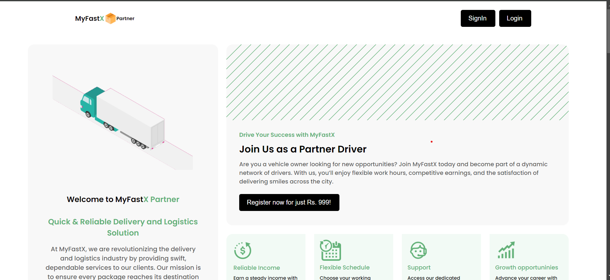
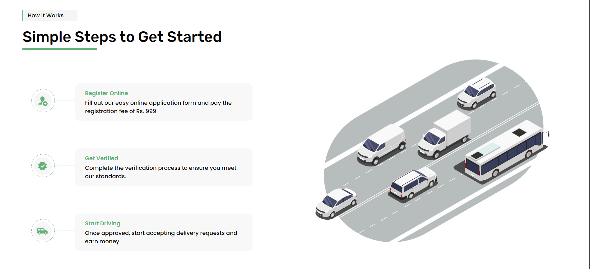
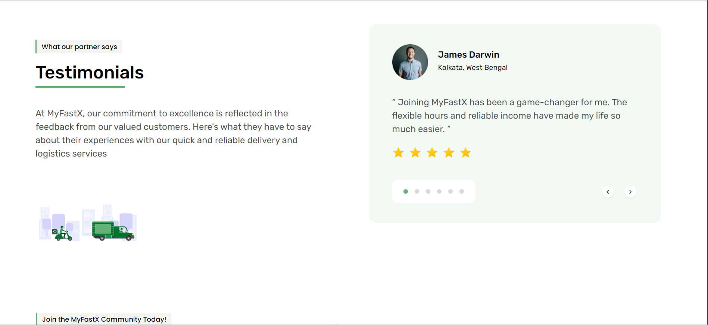
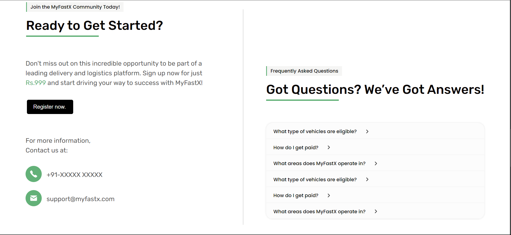
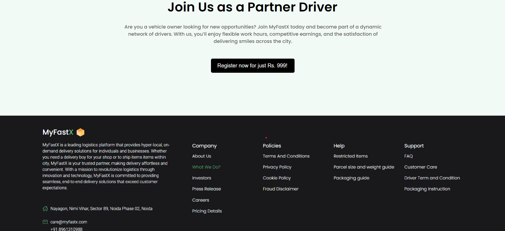
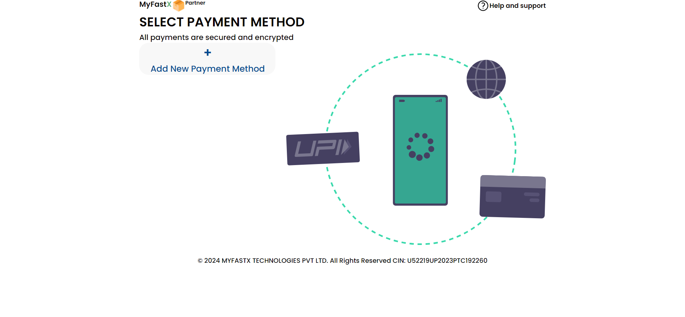
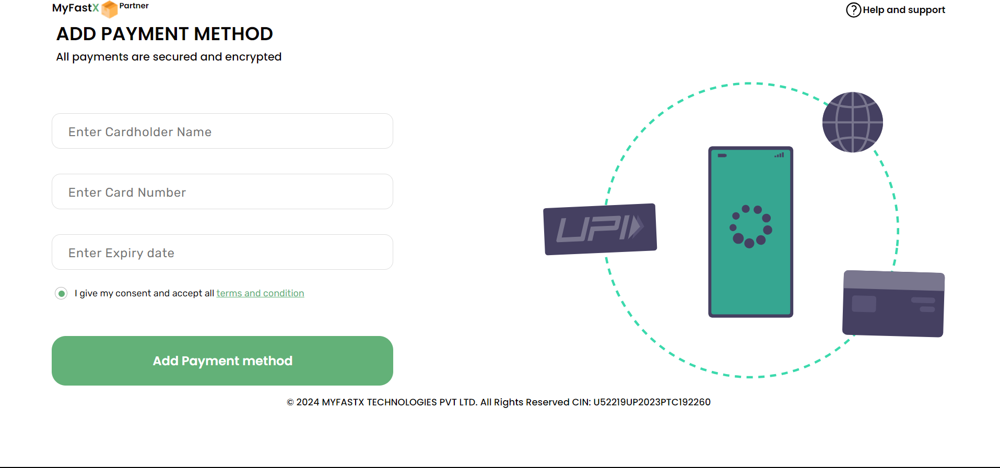
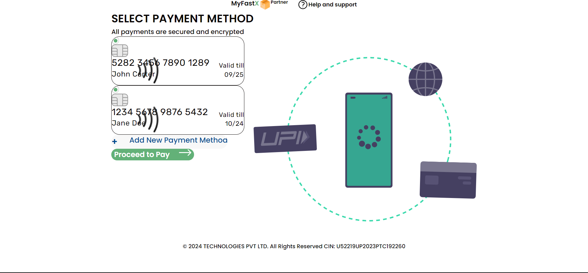

# MyFastX Partner

**MyFastX Partner** is a responsive payment integration page designed to securely manage and display multiple payment methods. The project demonstrates a clean, user-friendly interface where users can select a payment method and proceed with transactions securely.

## Features

- **Card Management**: Display and manage multiple payment methods with sample card details.
- **Secure Payment Flow**: All payments are secured and encrypted.
- **Responsive Design**: The interface adapts to different screen sizes, ensuring a consistent user experience.
- **Add New Payment Method**: Users can add new payment methods easily.
- **Proceed to Payment**: Allows users to proceed with selected payment methods to finalize transactions.

## Technologies Used

- **Next.js**: For server-side rendering and optimized performance.
- **React**: For building the user interface.
- **Tailwind CSS**: For styling and responsive design.
- **JavaScript**: Core functionality and interactivity.

## Setup Instructions

1) Open project folder in <a href="https://code.visualstudio.com/download">Visual Studio Code</a>
  2) In the terminal, run `npm install`
  3) Run `npm run dev` to view project in browser
  

  ##Images
  #Landing Pages
  
  
  
  
  
  #Payment Page
  
  
  

